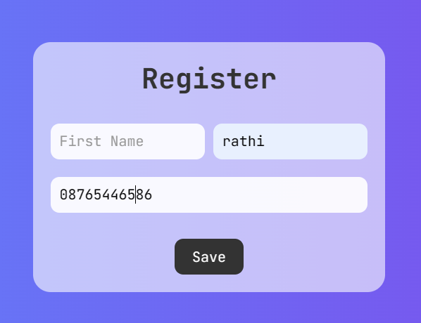
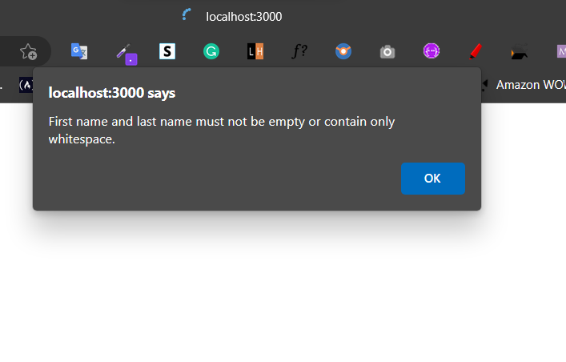
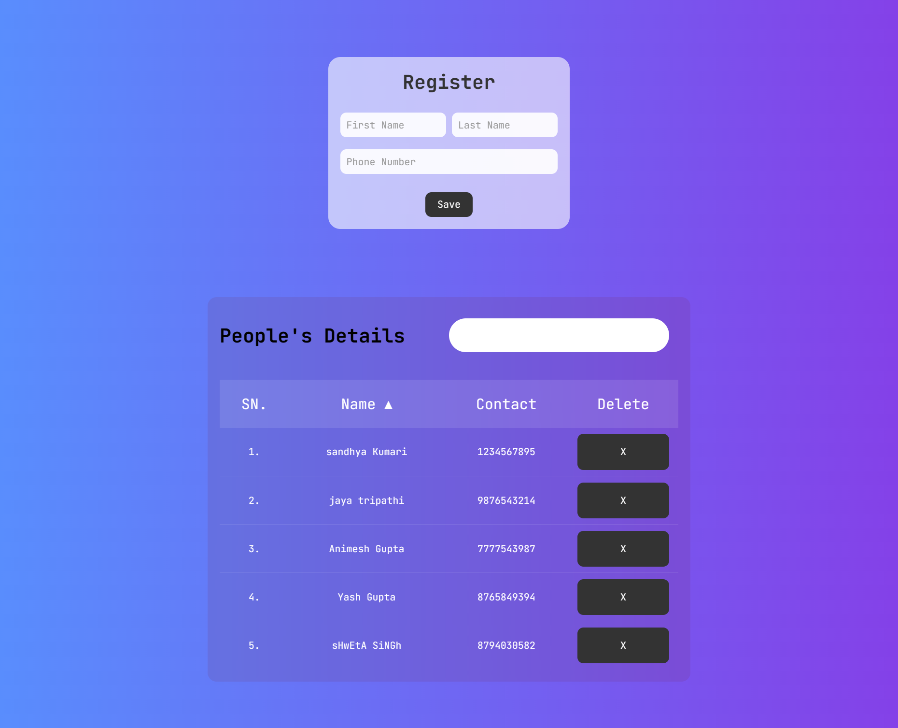
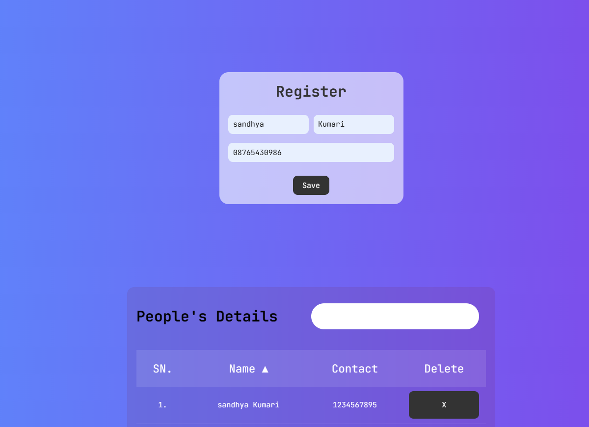
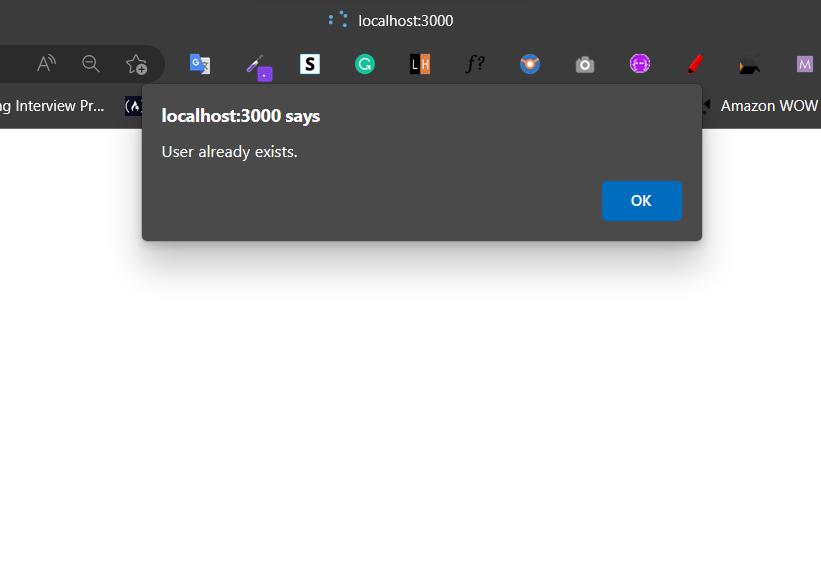
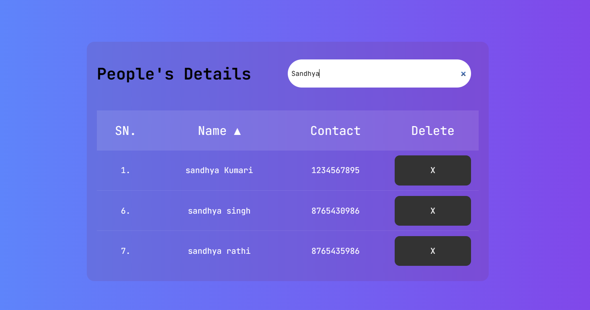
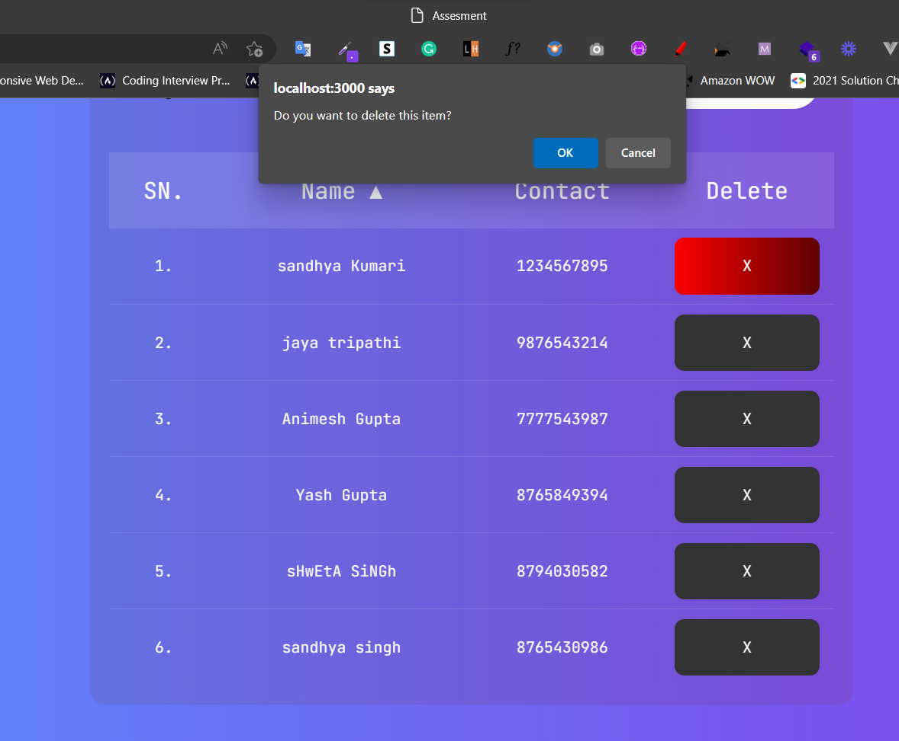
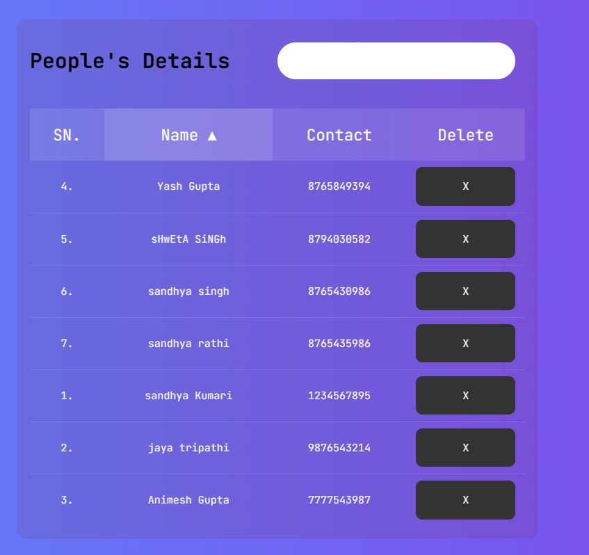
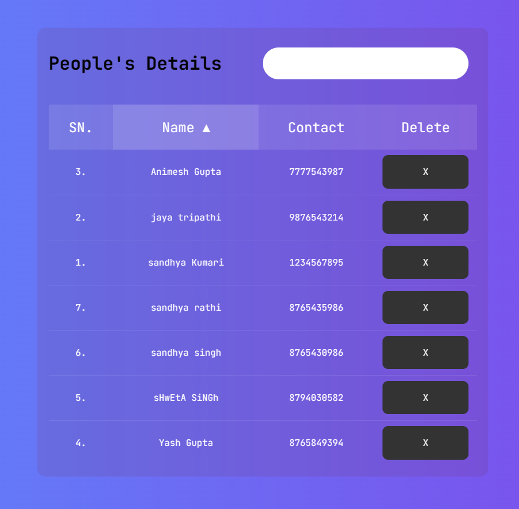

  <h1 align="center">Easyops-Job-assignment</h1>
  <p align="center">
   This is a repository for the Easyops job assignment, which is a web application built using HTML, CSS, JavaScript, EJS, Node.js, Express, and Mongoose.
    <br>
    <a href="https://easyops-job-assignment-sandhya312.onrender.com/" target="_blank">View Demo</a>
    
  </p>
</p>


<!-- TABLE OF CONTENTS -->
<details open="open">
  <summary><h2 style="display: inline-block">Table of Contents</h2></summary>
  <ol>
    <li>
      <a href="#about-the-project">About The Project</a>
      <ul>
        <li><a href="#built-with">Built With</a></li>
      </ul>
    </li>
    <li>
      <a href="#getting-started">Getting Started</a>
      <ul>
        <li><a href="#prerequisites">Prerequisites</a></li>
        <li><a href="#installation">Installation</a></li>
	<li><a href="#running">Running</a></li>
      </ul>
    </li>
    <li><a href="#contact">Contact</a></li>
  </ol>
</details>


<!-- ABOUT THE PROJECT -->
## About The Project
<p>The purpose of this project is to complete the job assignment given by the Easyops company.</p>


### Test Cases

- [x]  All inputs are mandatory.

<p align="center">
  
  
</p>

- [x]   On submit populate data in table..

<p align="center">
  
</p>

- [x] Person's name and contact number should be unique, duplicates are not allowed. 

<p align="center">
  
  
</p>

- [x]  A little bit of styling is required. 

- [x] Provide search by name. . 

<p align="center">
  
 
</p>

- [x] provide delete functionality with alert . 

<p align="center">
  

</p>

- [x] Implement sort by name (When someone clicks on Name 
column).

<p align="center">
  
  


</p>


### Built With

* [HTML](https://developer.mozilla.org/en-US/docs/web/html)
* [CSS](https://developer.mozilla.org/en-US/docs/web/css)
* [JS](https://developer.mozilla.org/en-US/docs/Web/javascript)
* [NodeJS](https://nodejs.org/en)
* [EXPRESS](https://expressjs.com/)
* [MongoDB](https://www.mongodb.com/)


<!-- GETTING STARTED -->
## Getting Started

To get a local copy up and running follow these simple steps.

### Prerequisites

Make sure you have these install on your system.
* [Git](https://nodejs.org/en/download/)
* [NodeJS](https://nodejs.org/en/download/)

### Installation

1. Clone the repo
   ```sh
   git clone https://github.com/Sandhya312/Easyops-Job-assignment.git
   ```
2. Install NPM packages
   ```sh
   npm install-all
   ```


### Running

First start the project

```
npx nodemon app.js or 
node app.js
```


<!-- CONTACT -->

## Contact

Sandhya - [@sandhya](https://www.linkedin.com/in/sandhyakumarii/)
